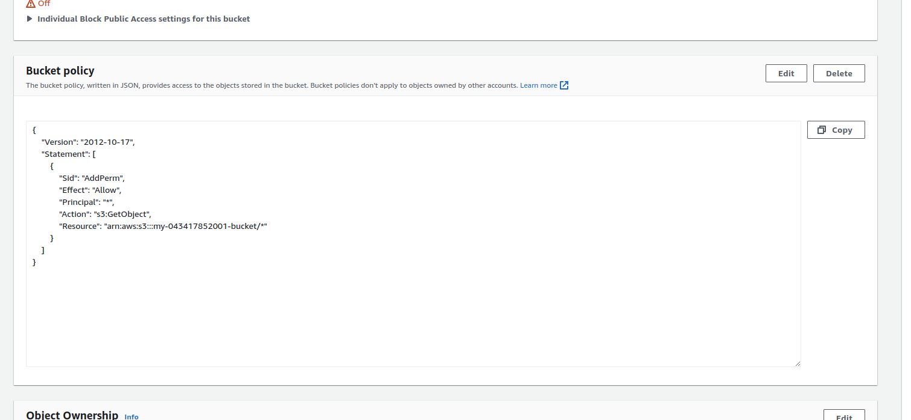
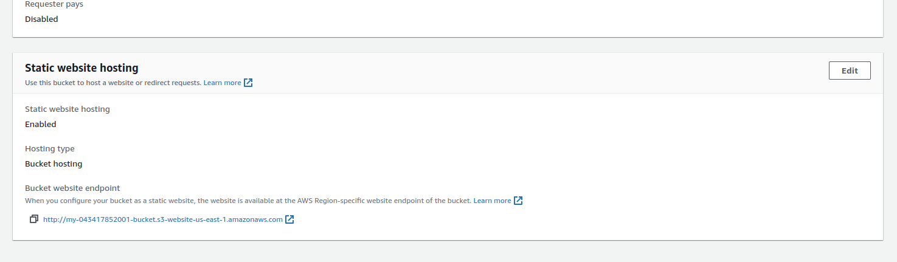
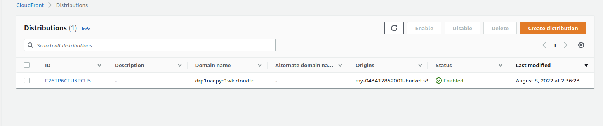
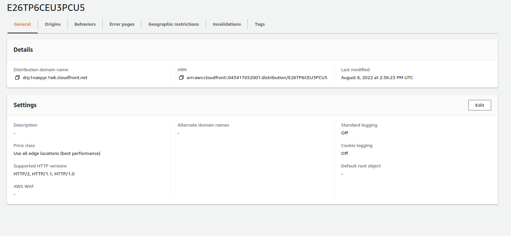

## Deploy Static Website on AWS
1- Create s3 bucket.

2- Upload the project files to the bucket.

3- Secure Bucket via IAM.

4- Configure S3 Bucket.

5- Distribute Website via CloudFront.

6- Access Website in Web Browser
- copied CloudFront domain name
- website-endpoint 
- S3 object URL. 
